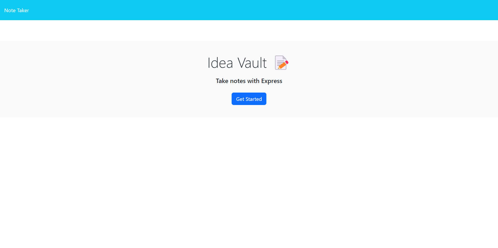
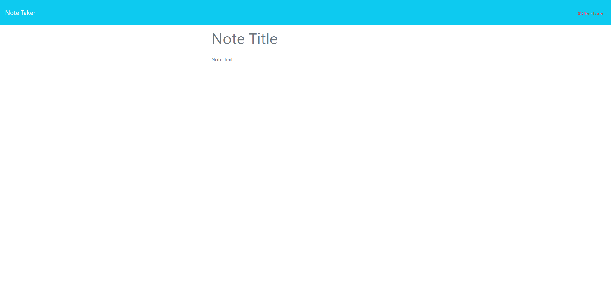
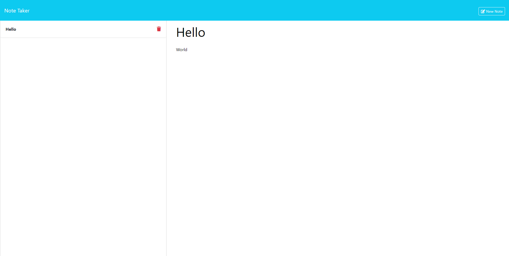

<div align="center">

# Idea Vault

[](https://opensource.org/licenses/MIT)


</div>

## Description

Idea Vault is a note-taking application designed for small business owners and individuals who need to organize their thoughts, keep track of tasks, and store ideas securely. With its intuitive interface and robust features, Idea Vault provides a seamless experience for managing notes effectively.

## Table of Contents

- [Description](#description)
- [Backend Integration](#backend-integration)
- [Installation](#installation)
- [Usage](#usage)
- [Features](#features)
- [Contributing](#contributing)
- [Tests](#tests)
- [License](#license)

## Backend Integration

The backend of Idea Vault is powered by Node.js and Express.js. Express.js is used to create a RESTful API for handling CRUD operations (Create, Read, Update, Delete) for managing notes. Node.js serves as the runtime environment for the backend server.

Notes are stored in a JSON file on the server, with each note having a unique identifier (ID) for data retrieval and management. When a new note is created, a unique ID is generated and assigned to the note before it is stored in the JSON file.

## Installation

To install Idea Vault, follow these steps:

1. **Clone the repository**:

```bash
git clone https://github.com/haartmuhn/idea-vault.git
```

2. **Navigate to the project directory**:

```bash
cd idea-vault
```

3. **Install dependencies**:

```bash
npm install
```

This will install Inquirer along with other required dependencies.

4. **Run the application**:

```bash
node server.js
```

5.  Open your web browser and navigate to `http://localhost:3000` to access the application.

## Usage

Upon opening Idea Vault, you will be presented with a landing page with a link to the notes page. Clicking on the link will take you to the notes page, where you can:

-   View existing notes listed in the left-hand column.
-   Enter a new note title and text in the right-hand column.
-   Save a new note using the "Save Note" button.
-   Clear the note form using the "Clear Form" button.
-   Click on an existing note to view and edit its details.
-   Delete a note by clicking on the delete button next to it.
-   Create a new note using the "New Note" button in the navigation.

The following images show the web application's appearance and functionality: 

<div align="center">








[Visit my website](https://haartmuhn.github.io/idea-vault/public)

</div>

## Features

-   **User-Friendly Interface:** Intuitive design makes it easy to create, view, and manage notes.
-   **Persistent Storage:** Notes are securely stored using a db.json file on the server-side.
-   **API Integration:** Express.js server handles API calls for saving, retrieving, and deleting notes.
-   **UUID Generation:** Each note is assigned a unique identifier (UUID) for efficient data management.
-   **Responsive Design:** Application is optimized for various screen sizes and devices.

## Contributing

Contributions to Idea Vault are welcome! To contribute, follow these steps:

1. Fork the repository.
2. Create your feature branch: `git checkout -b feature-name`
3. Commit your changes: `git commit -m 'Add new feature'`
4. Push to the branch: `git push origin feature-name`
5. Submit a pull request.

Please ensure your code adheres to the existing style, and include updates to documentation and tests as needed.

## Tests

To run tests, execute the following command:

```bash
npm test
```

(Note: You will need to write the tests based on the endpoints and operations your application performs, as this is not set up by default.)

## License
Idea Vault is licensed under the [MIT License](LICENSE). Feel free to use, modify, and distribute this application according to the terms of the license.
